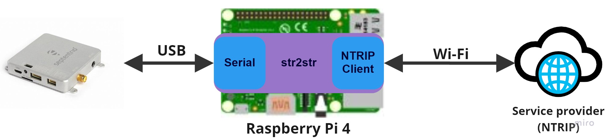
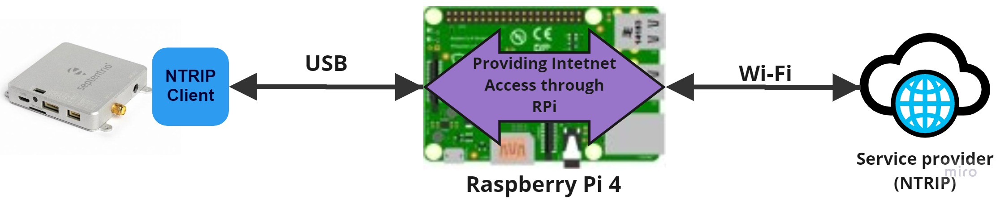

# Set Up Guide to use Third Party OSR and SSR correction services with Septentrio's Receivers for precise positioning

## GENERAL CONTEXT

### Why GNSS Corrections
  
GNSS (Global Navigation Satellite System) technology has revolutionized the way we navigate and position ourselves, with applications ranging from transportation to surveying and agriculture. GNSS provides location information based on signals received from satellites, but the accuracy of this information can be affected by various factors such as atmospheric conditions and signal blockages. To mitigate these effects, GNSS corrections are used to improve the accuracy of the position measurements.

## New GNSS Corrections mechanisms
  
In recent years, there has been a growing demand for high-accuracy positioning in various industries, including agriculture. This has led to the evolution of GNSS correction mechanisms, such as OSR (Observation Space Representation), SSR (State Space Representation) or LBand delivery, which provide higher accuracy and lower convergence time. However, with the introduction of multiple formats in the market, standardization is yet to be fully established, making it challenging for users to access and use these corrections.

## Facilitating GNSS corrections integration in agnostic way
  
To address this challenge, it is important to create an ecosystem around GNSS corrections that is agnostic, allowing users to access and use corrections from different providers easily. This way, users can take advantage of the growing range of correction options available, without being restricted to a single format or provider. In this context, this repository explores the importance of having GNSS corrections in an agnostic way, providing a brief overview of what corrections are and the evolution of correction mechanisms to newer formats through exploring the integration of corrections of companies with which Septentrio collaborates.

## Possibility of integrating correction services according to requirements and needs
  
Different options and flexibility are crucial when it comes to integrating GNSS technology. While corrections are a fundamental element of achieving high accuracy, having the ability to choose from a variety of corrections services allows for greater flexibility and adaptability as these services continue to evolve over time. Different applications have different requirements, and each service offers unique advantages in terms of performance and different coverage regions.

## Make it easy
  
It's important to make it easy for users/integrators to evaluate these options and choose the best service for their needs.  Additionally, making these options easily accessible to the community is equally important. Platforms like Github enable to document and create demonstrators that allow users to try out different correction services with ease. 

## AUTHORS
  
| Name | GitHub |
|------|--------|
| Iker Uranga | <a href="https://github.com/IkerUranga10">IkerUranga10</a>   |    

## MAINTAINER
  
| GitHub |
|--------|
| <a href="https://github.com/septentrio-users">septentrio-users</a>   |    

## DO YOU HAVE ANY QUESTIONS? CONTACT SEPTENTRIO SUPPORT TEAM

| <a href="https://web.septentrio.com/GH-SSN-support ">Septentrio Support Page</a>|
|---|

## SEPTENTRIO LINKS FOR USERS
 
| Contact                                                                          | Septentrio Home Page                                                        |
|----------------------------------------------------------------------------------|-----------------------------------------------------------------------------|
| <a href="https://web.septentrio.com/GH-SSN-contact ">Septentrio Contact Page</a> | <a href="https://web.septentrio.com/UBL-SSN-home">Septentrio Home Page</a> |

## DISCLAIMER
  
This set of guidelines consist of a several practical examplse to help Septentrio Module users and developers to integrate third party GNSS corrections. The guidelines are based on a concrete setup, which you may or may not use to follow the integration guidelines.

It is desirable to mention the disclaimer about that setup and the guides in general before starting reading this guide.
  
| <a href="https://github.com/septentrio-gnss/Septentrio_AgnosticCorrectionsProgram/tree/main/Receiver%20and%20Raspberry%20Setup#disclaimer">Click here to know more about the Setup in which these guides are based and general implementation documentation disclaimer</a> |
|---|

      
## TABLE OF CONTENTS

<!--ts-->

* [Introduction](#introduction)
* [Who is Septentrio?](#who-is-septentrio)
* [mosaic-go GNSS module receiver evaluation kit and other Septentrio modules](#mosaic-go-gnss-module-receiver-evaluation-kit-and-other-septentrio-modules)
* [Is the project Open Source?](#is-the-project-open-source)
* [Implementation with different Correction Service Providers](#implementation-with-different-correction-service-providers)
  * [Integration flowchart](#integration-flowchart)
  * [Selecting the company](#selecting-the-company)
    * [Point One Navigation (Polaris)](#point-one-navigation)
    * [Swift Navigation (Skylark)](#swift-navigation)
    * [u-blox (PointPerfect)](#u-blox)
   
* [Other guides](#other-guides)
   * [Raspberry Pi 4 Model B and Mosaic-Go GNSS module receiver evaluation kit setup](#raspberry-Pi-4-model-b-and-mosaic-go-gnss-module-receiver-evaluation-kit-setup)
   * [RTKLIB str2str tool compilation and use guide](#rtklib-str2str-tool-compilation-and-use-guide)
   * [Transmit internet connection through the Raspberry Pi to the receiver using a USB cable guide](#transmit-internet-connection-through-the-raspberry-pi-to-the-receiver-using-a-usb-cable-guide)

 
### 

<!--te-->

## INTRODUCTION

Welcome to the Septentrio's Agnostic GNSS Corrections Integration Guide repository, where you can find step-by-step guides for integrating a system that uses a Raspberry Pi 4 Model B to provide **Septentrio mosai™ GNSS Receiver Modules** with State Space Representation (SSR) and Observation Space Representation (OSR) corrections from third-party companies.

If you're looking to set up a system that provides SSR and OSR corrections to Septentrio receivers using an embedded Linux based system such as the Raspberry Pi 4 Model B, you've come to the right place! This repository offers comprehensive guides on how to configure your Raspberry Pi and receiver, and implement third-party correction services.

The guides are divided into **two main parts**. 

- **Initial configuration:** The first part covers the configuration of your Raspberry Pi 4 Model B and receiver system, which you can access by navigating to the different How-To guides. 

| <a href="https://github.com/septentrio-gnss/Septentrio_AgnosticCorrectionsProgram/tree/main/Receiver%20and%20Raspberry%20Setup#set-up-guide-to-use-third-parties-corrections-with-septentrios-receiver-for-precise-positioning">Click here to access to the Raspberry Pi and receiver setup guide.</a> |
|---|
   

- **Implementation of the third-party correction service:** Once you've completed the previously mentioned setup guide, the second part will guide you through the implementation of the third-party correction service you've selected **depending on your application requirements**. We've included links to the implementation guides for libraries, APIs, and SDKs from various companies offering correction services. 

| <a href="https://github.com/septentrio-gnss/Septentrio_AgnosticCorrectionsProgram#implementation-with-different-correction-service-providers">Click here to access a list of step-by-step guides on how to integrate corrections from different third party companies that Septentrio is collaborating with for this project.</a> |
|---|
   

To get started, simply click on the link to the setup guide and follow the step-by-step instructions. Whether you're an experienced developer or just getting started, our guides make it easy to integrate a powerful correction system using Raspberry Pi and <a href="https://web.septentrio.com/GH-SSN-RX">Septentrio receivers</a>. So why wait? Click on the links above to get started today!

Thank you for your confidence in choosing us for accurate, secure and robust positioning, and even more so with form agnostic corrections! If you have any questions or feedback, please don't hesitate to reach out to us at <a href="https://web.septentrio.com/GH-SSN-support ">Septentrio support page.</a>

## WHO IS SEPTENTRIO?

    

Welcome to Septentrio, your trusted source for high-precision GPS/GNSS equipment designed for use in the most demanding applications. Our multi-frequency, multi-constellation products are used across a wide range of industries, including marine, construction, precision agriculture, logistics, machine control, rail, automotive, survey and mapping, geographic information systems (GIS), unmanned aerial vehicles (UAVs), and scientific research.

   
| <a href="https://web.septentrio.com/GH-SSN-home">Click here to the access to Septentrio home page.</a> |
|---|
      

At Septentrio, we are committed to delivering consistently accurate and precise GNSS positioning solutions that are scalable to centimeter-level accuracy in the most challenging environments. Our receivers are designed to perform solidly in the most challenging conditions, delivering reliable and robust performance that you can count on.

We offer a range of products to meet your needs, including OEM boards, housed receivers, and smart antennas. Whether you're looking for a fully integrated solution or a custom-designed solution tailored to your specific needs, we have the expertise and experience to help you achieve your goals.

Thank you for choosing Septentrio as your trusted partner for high-precision GNSS equipment.
   
### mosaic-go GNSS module receiver evaluation kit and other Septentrio modules

    
   
This whole project of integration of third party corrections with septentrio receivers has been developed and tested with our mosaic-go GNSS module receiver evaluation kit. It's a multi-band, multi-constellation GPS/GNSS receiver **mosaic-X5 integrated** inside a small metallic housing. This guide has been written around mosaic-go however the same guide can also be used with other Septentrio receivers such as mosaic-go heading, or other product families such as AsteRx OEM boards and housed receivers.
  

    
  
mosaic-X5 is Septentrio's mosaic-X5 multi-constellation GNSS receiver is a low-power surface-mount module with a wide array of interfaces and is designed for mass-market applications such as robotics and autonomous systems. 
   
**mosaic-X5 GNSS Module**
  

      
| <a href="https://web.septentrio.com/GH-SSN-contact">Click here to the access to the contact page of the mosaic-X5 GNSS Module.</a> |
|---|
      

   
**All Septentrio GNSS Module products**
  

| <a href="https://web.septentrio.com/GH-SSN-modules">Click here to the access to the all Septentrio GNSS Modules page.</a> |
|---|
   

   
## IS THE PROJECT OPEN SOURCE?

Yes, as it allows easy adaptations and thus enables the robotics and autonomous community to create their own spin off projects.
As such this can be also a starting reference point for integrators when in need of GNSS integration.

With open source it means that the following is provided:
-Editable source files
-Modifications and spin off projects allowed
-You are allowed to sell your version. No -NC limitations.
-May require attribution
-We encourage you to stand on our shoulders and even make money at it! 

More info about licensing can be found here: 
<a href="https://creativecommons.org/licenses/by-sa/4.0/">Creative Commons Attribution Share-Alike License.</a> and <a href="https://www.oshwa.org/definition/">Open Source HW</a>

## IMPLEMENTATION WITH DIFFERENT CORRECTION SERVICE PROVIDERS

This section contains the guides on how to implement third-party correction services using a Raspberry Pi 4 Model B and a Mosaic-X5 receiver. Septentrio collaborates with a variety of companies to provide you with sample guides on how to integrate their correction services into the Raspberry Pi - Mosaic receiver setup.

### Integration flowchart

    
    
### Selecting the company

When selecting a correction service, it's important to consider the different features and coverage areas offered by each company, as well as your specific application's performance requirements and needs. To help you make an informed decision, there is compiled a list of the companies that Septentrio collaborates with and their respective guidelines in this repository. 

Also you can access to the Septentrio Support page for more information about which of the following services best fits your needs and circumstances.

| <a href="https://web.septentrio.com/GH-SSN-support ">Click here to access to the Septentrio Support page</a> |
|---|
   

 
Below is a list of partner companies for which we have created How-To guides for the integration of their correction services with Septentrio receivers.
 

   
#### Point One Navigation

    
    
| <a href="https://github.com/septentrio-gnss/PointOneCorrectionsWithSeptentrio">Point One Navigation Polaris Corrections With Septentrio Guide.</a> |
|---|
   
#### Swift Navigation
   

    
    
| <a href="https://github.com/septentrio-gnss/SwiftCorrectionsWithSeptentrio">SwiftNav Skylark Corrections With Septentrio Guide.</a> |
|---|
    
#### u-blox
   

    

| <a href="https://github.com/septentrio-gnss/uBloxCorrectionsWithSeptentrio">u-blox PointPerfect Corrections With Septentrio Guide.</a> |
|---|
   

Some of the guidelines may require additional instructions or steps to be followed, which are common among multiple companies' implementations. To help streamline the process, we've included extra guides in this repository, such as the implementation guide for setting up your Raspberry Pi 4 Model B and Septentrio Mosaix-X5 receiver.

In the <a href="https://github.com/septentrio-gnss/Septentrio_AgnosticCorrectionsProgram#other-guides">following section below</a> you can access this and other complementary guides.

## Other guides

This repository additionally contains other guides that are complementary to the implementation guides of the different libraries, APIs and SDKs of the different companies with which Septentrio collaborates for this project. 
   
 ### Raspberry Pi 4 Model B and Mosaic-Go GNSS module receiver evaluation kit setup

The main example of these complementary guides is the Set Up Guide to use Third parties corrections with Septentrio's Receiver for precise positioning, which is the setup on which all implementations of these libraries, APIs and SDKs are based.
  

   
| <a href="https://github.com/septentrio-gnss/Septentrio_AgnosticCorrectionsProgram/tree/main/Receiver%20and%20Raspberry%20Setup#set-up-guide-to-use-third-parties-osr-corrections-with-septentrios-receiver-for-precise-positioning">Click here to the access to setup preparation guide</a>. |
|---|
   

Here is a simplified schematic of the general operation of the Raspberry Pi setup in combination with the Mosaic-Go Module.

    

 
### RTKLIB str2str tool compilation and use guide

This repository is about how to implement the tool called **str2str from the RTKLIB library**. The use of the tool consists of downloading the RTKLIB repository, compiling the str2str tool and using it to connect to an NTRIP Server/Caster and forward the incoming corrections to the receiver.

The str2str tool **is running inside the Raspberry Pi and it creates an NTRIP client** to access the corrections, while sending them to the receiver. The steps for how to download, compile and use the tool for this specific application can be found in the following guide:
  
   

   
| <a href="https://github.com/septentrio-gnss/Septentrio_AgnosticCorrectionsProgram/tree/main/str2str#how-to-use-rtklibs-str2str-tool-to-receive-corrections-from-ntrip-server-and-send-them-to-septentrio-receiver">Click here to the access to RTKLIB's str2str tool compilation and use guidel</a>. |
|---|
   

 
Here is a simplified schematic of the general operation of using the str2str tool to access the corrections using an NTRIP client on the Raspberry Pi.

    

### Transmit internet connection through the Raspberry Pi to the receiver using a USB cable guide

This is another alternative for using NTRIP. In this case you would be using the NTRIP Client within the Septentrio Module.

The guide consists of executing a series of commands that configure the Raspberry Pi operating system to provide internet to a device that is connected to the Raspberry Pi through a USB cable. Therefore, if we connect the receiver to the Raspberry Pi with a USB cable after executing the commands, the receiver, and therefore its NTRIP client, will have access to the internet to get the corrections of the selected provider.
  

      
| <a href="https://github.com/septentrio-gnss/Septentrio_AgnosticCorrectionsProgram/tree/main/SharingInternetFromRaspberryPiToReceiver#how-to-share-internet-connection-from-the-raspberry-pi-to-the-receiver-using-an-usb-cable">Click here to the access to the guide of how to Transmit internet connection through the Raspberry Pi to the receiver using a USB cable</a>. |
|---|
      

Here is a simplified schematic of the general operation of the system with the configuration of the operating system of the Raspberry Pi to provide internet connection to the receiver via USB cable.

    
