

# Set Up Guide to use Third parties corrections with Septentrio's Receiver for precise positioning

## AUTHORS
  
| Name | GitHub |
|------|--------|
| Iker Uranga | <a href="https://github.com/IkerUranga10">IkerUranga10</a>   |    

## MAINTAINER
  
| GitHub |
|--------|
| <a href="https://github.com/septentrio-users">septentrio-users</a>   |    

## DO YOU HAVE ANY QUESTIONS? CONTACT SEPTENTRIO SUPPORT TEAM

| <a href="https://web.septentrio.com/GH-SSN-support ">Septentrio Support Page</a>|
|---|

## SEPTENTRIO LINKS FOR USERS
 
| Contact                                                                          | Septentrio Home Page                                                        |
|----------------------------------------------------------------------------------|-----------------------------------------------------------------------------|
| <a href="https://web.septentrio.com/GH-SSN-contact ">Septentrio Contact Page</a> | <a href="https://web.septentrio.com/GH-SSN-home">Septentrio Home Page</a> |

## TABLE OF CONTENTS

<!--ts-->
* [Disclaimer](#disclaimer)
* [Needed materials](#needed-materials)
    * [Septentrio's Mosaic-Go GNSS Receiver](#septentrios-mosaic-go-gnss-receiver)
* [Raspberry Pi Model B and Hardware Considerations](#raspberry-pi-model-b-and-hardware-considerations)
* [Implementation setup](#implementation-setup)
    * [Raspberry Pi OS Installation](#raspberry-pi-os-installation)
        * [Raspberry Pi OS Versions](#raspberry-pi-os-versions)
        * [Prerequisites to install Raspberry Pi OS](#prerequisites-to-install-raspberry-pi-os)
        * [Using Raspberry Pi Imager](#using-raspberry-pi-imager)
        * [Raspberry Pi OS Installation](#raspberry-pi-os-installation)
        * [Raspberry Pi Board Connection](#raspberry-pi-board-connection)
        * [Raspberry Pi OS Desktop Set Up](#raspberry-pi-os-desktop-set-up)
    * [Receiver Set Up](#receiver-set-up)
        * [Serial Permissions In Raspberry Pi OS](#serial-permissions-in-raspberry-pi-os)
* [General flowchart and system scheme](#General-flowchart-and-system-scheme)  
* [Next step: Implementation of different correction services](#next-step-implementation-of-different-correction-services)  

<!--te-->

## DISCLAIMER

For the implementation of the <a href="https://github.com/septentrio-gnss/SeptentrioAgnostic#implementation-with-different-correction-service-providers">different correction services offered by the different companies with which Septentrio collaborates</a>, several repositories and guides have been created to help the user with the implementation of these services.

All these guides have been developed based on a specific setup described in <a href="https://github.com/septentrio-gnss/SeptentrioAgnostic/tree/main/Receiver%20and%20Raspberry%20Setup#set-up-guide-to-use-third-parties-corrections-with-septentrios-receiver-for-precise-positioning">this documentation</a>.

The purpose of this documentation is to **provide an example of the implementation of all the services**, but other users may have a different setup with different receiver or computer (external CPU).

On the other hand, they all have several aspects in common:

- For all the guides, since it is assumed that the user has the setup presented in this documentation, the Septentrio receiver or module communicates with the Raspberry Pi with a USB cable. For example, to perform communications via serial port or NTRIP.

- All the implementation guides of the different correction services are intended to provide corrections in RTCM v3 format to the receiver using the mentioned USB cable.

Therefore, all the guides in this project assume these two common aspects. However, this does not mean that you cannot integrate these correction services in a different setup, as **the one presented here is an example of a possible integration**.

Also, all tests performed by Septentrio to validate the performance of all correction services using Septentrio modules have been performed **using this setup**.

Please, if you have any doubts about this setup or any other questions about the implementation of the remediation services of the companies with which Septentrio collaborates, do not hesitate to navigate to our technical support section on our website.

Do you have questions?

| <a href="https://web.septentrio.com/GH-SSN-support ">Click here to access to the Septentrio Support page</a> |
|---|

Navigate to the main page:

| <a href="https://github.com/septentrio-gnss/SeptentrioAgnostic/blob/main/README.md#table-of-contents">Click here to nacigate to the Main page of the documentation</a> |
|---|
   

## NEEDED MATERIALS

All needed materials are shown in the following picture and list.

    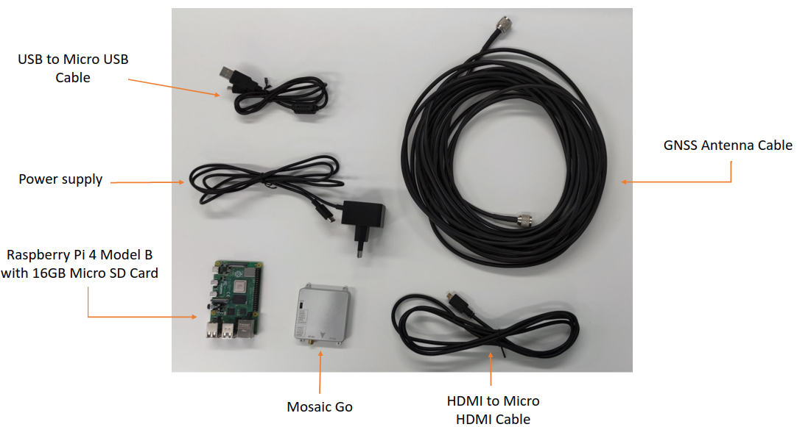

Make sure you have a keyboard, mouse and monitor for comfortable use of the operating system.

Needed materials:

- USB to Micro USB Cable
- Power supply
- Raspberry Pi 4 Model B
- 16GB SD Card
- HDMI to Micro HDMI Cable
- GNSS Antenna Cable
- Mosaic-Go GNSS Receiver
- GNSS Antenna already installed

To implement GNSS correction services using a Raspberry Pi, it's necessary to have the proper hardware. There are several Raspberry Pi packs available on the market that provide all the necessary components, including the Raspberry Pi itself, power supply, and SD card. However, it's important to note that these packs do not include the Septentrio Mosaic-Go module, GNSS antenna and antenna cable, which must be obtained separately.

Please be aware that this documentation does not cover the installation and setup of the GNSS antenna. It is assumed that the user already has a working GNSS antenna and knows how to install it. Therefore, regarding antenna related components, this documentation only deals with the connection of the already installed and operational antenna with the Mosaic-Go module.

**Note:** It's worth noting that an Ethernet cable is not required if the Raspberry Pi has an internet connection via Wi-Fi. However, if your application requires an internet connection via Ethernet, you will need to configure the Raspberry Pi accordingly.

### Septentrio's Mosaic-Go GNSS Receiver

    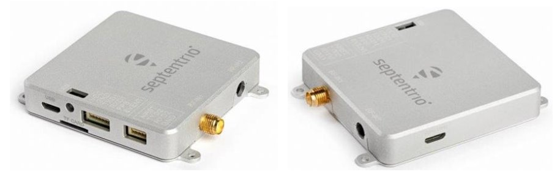

In this setup, we have used the Septentrio Mosaic-Go model. However, any other <a href="https://web.septentrio.com/GH-SSN-RX">Septentrio receivers</a> that can communicate with a Raspberry Pi can be used instead. If a different connector is used, it may be necessary to modify the configuration of some of the libraries, APIs or SDKs provided by the different GNSS correction service companies that collaborate with Septentrio for this project.

The Mosaic-Go is a high-precision GPS/GNSS evaluation kit that offers best-in-class centimeter-level positioning performance, even in challenging environments. It is a compact, multi-band, multi-constellation GPS/GNSS receiver integrated with a mosaic-X5 in a small metallic housing. The Mosaic-Go is specifically designed for easy evaluation of mosaic-X5 for applications such as UAVs, robotics, autonomous systems, construction and agriculture. This high-performance module supports all current GNSS satellite signals and is future-proof for upcoming signals and services. Its unique built-in <a href="https://web.septentrio.com/GH-SSN-algorithms">AIM+ technology for interference monitoring and mitigation.</a>, as well as anti-spoofing, ensures the best availability, reliability, and precision.

The evaluation kit provides an opportunity to discover and test the mosaic-X5 module. You can integrate the Mosaic-Go evaluation kit into your system using any of the following connections: COM ports, USB 2.0, or SD memory card. 

If you have any questions or feedback, please don't hesitate to reach out to us at <a href="https://web.septentrio.com/GH-SSN-support">Septentrio support page.</a>

## RASPBERRY PI MODEL B AND HARDWARE CONSIDERATIONS

For this implementation a Raspberry PI 4 Model B with 4 GB of RAM has been used. The use of another model of Raspberry Pi should work but has not been tested, although the use of the this model is recommended. Each one of the different Raspberry Pi models has hardware changes that could affect the performance of the system. In general, the libraries, APIs or SDKs offered by the different companies with which Septentrio collaborates for this project do not require excessive hardware usage. **Therefore, the use of another Raspberry PI model should not be a problem, but has not been tested by Septentrio**. 

Additionally it should be taken into account that the interface of the Raspberry Pi changes with the model, and that for example for the Raspberry Pi 3, the video output is an HDMI port and not a Micro HDMI port as it is the case of the Raspberry Pi 4 Model B, so another type of cable would be needed to connect it to a screen.

## IMPLEMENTATION SETUP

### Raspberry Pi OS Installation

    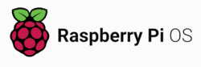

For the demostration, the first step is to install an Operating System inside micro SD Card for which **another computer is needed**. The Selected Operation System is Raspberry Pi OS 64-Bits, wich has "Bullseye" Debian 11 version. Raspberry Pi Os is the <a href="https://www.raspberrypi.com/software/operating-systems/"> official supported operating system</a> by Raspberry.

#### Raspberry Pi OS Versions

Raspberry Pi OS is offered in three “versions”:

- Full: Raspberry Pi OS with desktop and recommended software.
- Desktop: Raspberry Pi OS with desktop.
- Lite: Minimal image for Raspberry Pi OS (no interface, command line only).

#### Prerequisites to install Raspberry Pi OS

To follow the instalation guide, you need:

- An Internet connection.
- A computer to download and flash Raspberry Pi OS.
- An SD card reader (USB or built-in computer).
- A minimum 8 GB micro SD card.

#### Using Raspberry Pi Imager

Raspberry Pi Imager is the quick and easy way to install Raspberry Pi OS and other operating systems to a micro SD card, ready to use with your Raspberry Pi.

If you want to learn how to install Raspberry Pi OS you can follow <a href="https://www.youtube.com/watch?v=ntaXWS8Lk34">this video of How to use Raspberry Pi Imager</a>, by <a href="https://www.youtube.com/@raspberrypi">Raspberry Pi's YouTube Channel</a> or read more in the <a href="https://www.raspberrypi.com/documentation/computers/os.html">official documentation</a>.

        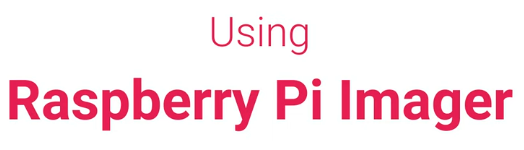

#### Raspberry Pi OS Installation

Download and install Raspberry Pi Imager. For this demostration we have downloaded 1.7.3 version of the Imager.

| <a href="https://www.raspberrypi.com/software/">Click here to download Raspberry Pi Imager from the official Raspberry website.</a> |
|---|

                                            

    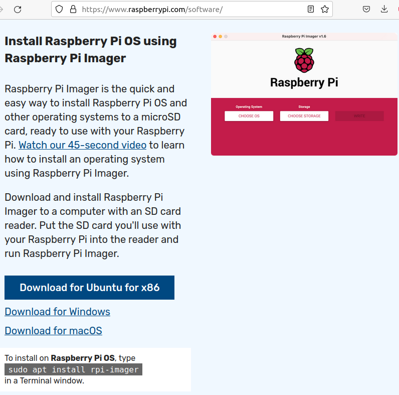

One the program is opened, you should see the following window in your screen.

    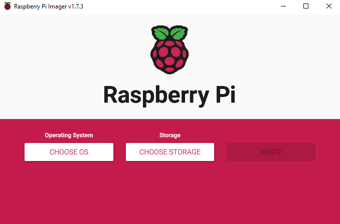

The next step is to select which Operating System you want to install and its destination.
By default, the application selects Raspberry Pi OS (32-Bit), but for the case of this Set UP with Septentrio receiver we will select **RASPBERRY PI OS 64-BIT** option and then seletc Storage SDHC CARD, which is our Micro SD Card. Then we press WRITE.

    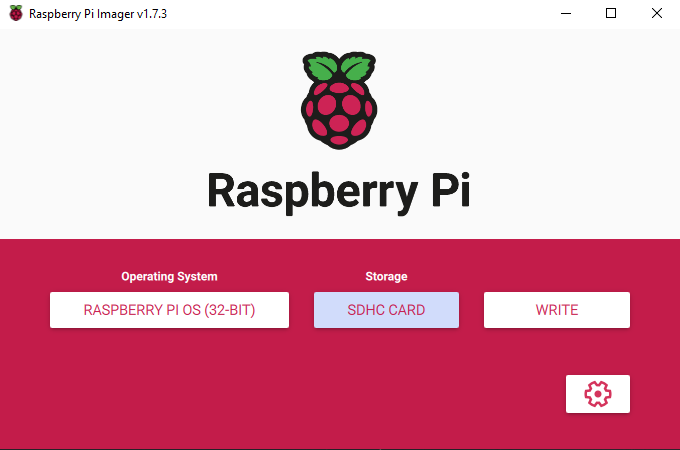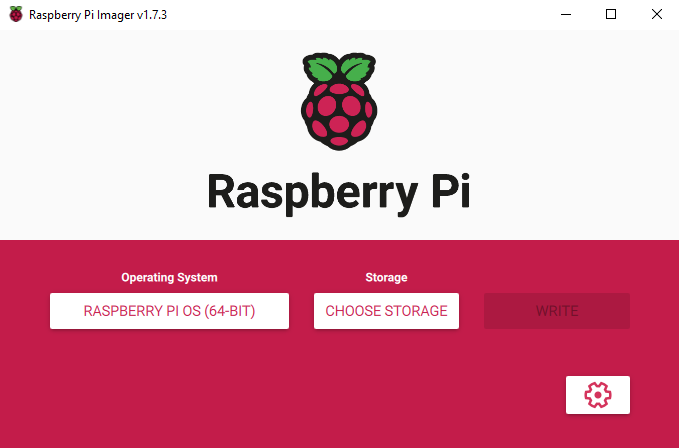

Then we need to confirm the installatoin operation and wait until the program finishes.

    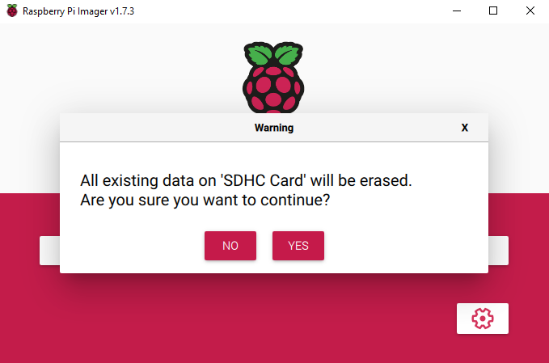

    

When the following pop-up appears in the screen, the installations has been done correctly and we have to select CONTINUE.

    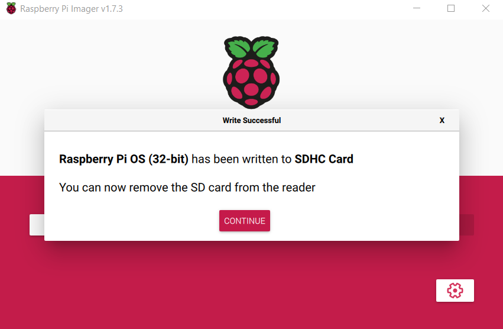

#### Raspberry Pi Board Connection

For the connection of the Raspberry Pi board we need to:

- Connect Raspberry Pi to a screen using Micro HDMI port with the Micro HDMI to HDMI cable.
- Insert Micro SD.
- Connect Keyboard and Mouse into USB Ports.

And finally, power the Raspberry Pi with USB-C cable. Once the Raspberry Pi is supplied with power, you should see the Raspberry Pi OS Desktop Set Up on the screen.

#### Raspberry Pi OS Desktop Set Up

Once the Operating System setup is displayed on the screen:

- Press Next to get started.
- Set the counrty, lenguage and keyboard lenguage.
- Set an username and password.
- Set up Screen size.
- Select Wi-Fi Network. (Recommended)
- Update Software.
- Reboot.

### Receiver Set Up

For the Mosaic-Go module setup its needed to connect the receiver and Raspberry Pi using the USB to Micro-USB Cable. Micro-USB Connector in the Receiver and USB in the Raspberry Pi. You can see the Mosaic-Go interface in the following pictures.

    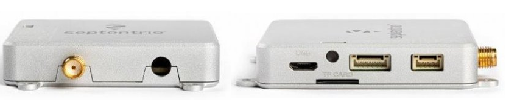

The next step would be to connect the GNSS antenna to the receiver via antenna cable. For more information about the Mosaic-Go Interface, please visit <a href="https://web.septentrio.com/GH-SSN-modules">Septentrio's GNSS Modules web page</a>.

**Note:**
If you're running into issues with the Receiver/Raspberry Pi connection, you may not have read/write access to the serial port on your machine. This is a common issue when using the serial port in Linux. To fix it, run the following command in a terminal.

    sudo usermod -a -G dialout $USER

## General flowchart and system scheme

The general flowchart of the system:

    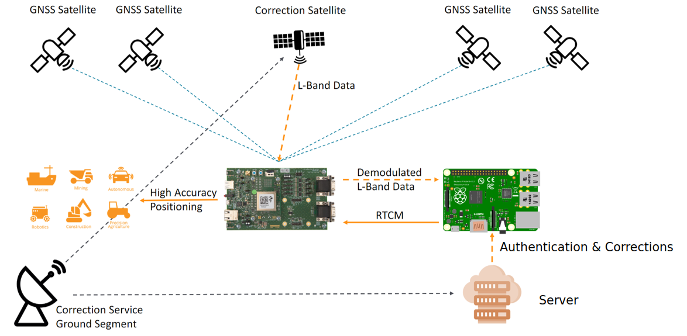

Simplified scheme of the system:
   

    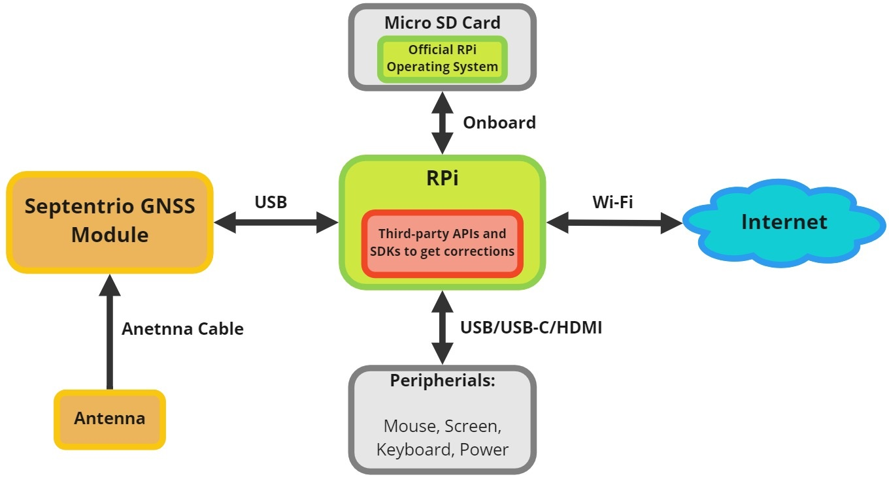

## NEXT STEP: IMPLEMENTATION OF DIFFERENT CORRECTION SERVICES
   
At this point, the guide assumes that you have already set up the receiver and Raspberry Pi hardware following the steps provided in the previous sections of this documentation page.

To proceed with the implementation of the third-party correction service, first of all you need to select one of the companies that Septentrio collaborates with for this project. Once you have selected the company, follow the instructions to implement their library, API or SDK on your Raspberry Pi. It is important to note that different companies have different features and coverage areas, so it is recommended to research and select the company that best suits your specific needs and performance requirements.

After completing the implementation of the service, the Raspberry Pi you should be able to get corrections on the receiver for high-precision positioning.

|  <a href="https://github.com/septentrio-gnss/SeptentrioAgnostic#implementation-with-different-correction-service-providers">Click here to the navigate to the Implementation with different Correction Service Providers guides</a> |
|---|

