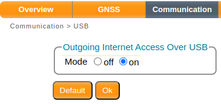
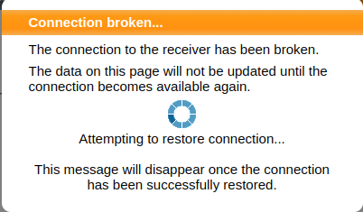
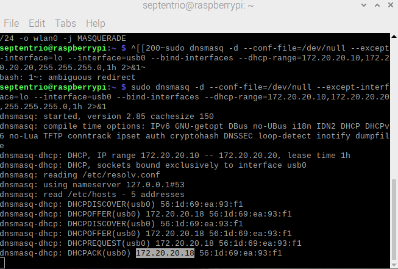
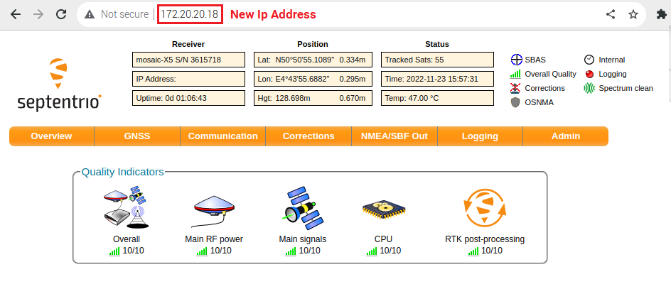

# How to share internet connection From the Raspberry Pi to the Receiver using an USB cable

## AUTHORS
  
| Name | GitHub |
|------|--------|
| Iker Uranga | <a href="https://github.com/IkerUranga10">IkerUranga10</a>   |    

## MAINTAINER
  
| GitHub |
|--------|
| <a href="https://github.com/septentrio-users">septentrio-users</a>   |    

## DO YOU HAVE ANY QUESTIONS? CONTACT SEPTENTRIO SUPPORT TEAM

| <a href="https://web.septentrio.com/GH-SSN-support ">Septentrio Support Page</a>|
|---|

## SEPTENTRIO LINKS FOR USERS
 
| Contact                                                                          | Septentrio Home Page                                                        |
|----------------------------------------------------------------------------------|-----------------------------------------------------------------------------|
| <a href="https://web.septentrio.com/GH-SSN-contact ">Septentrio Contact Page</a> | <a href="https://web.septentrio.com/GH-SSN-home">Septentrio Home Page</a> |

## DISCLAIMER
  
This set of guidelines consist of a several practical examplse to help Septentrio Module users and developers to integrate third party GNSS corrections. The guidelines are based on a concrete setup, which you may or may not use to follow the integration guidelines.

It is desirable to mention the disclaimer about that setup and the guides in general before starting reading this guide.
  
| <a href="https://github.com/septentrio-gnss/Septentrio_AgnosticCorrectionsProgram/tree/main/Receiver%20and%20Raspberry%20Setup#disclaimer">Click here to know more about the Setup in which these guides are based and general implementation documentation disclaimer</a> |
|---|

## TABLE OF CONTENTS

<!--ts-->

* [Introduction](#introduction)
* [Simplified system scheme](#simplified-system-scheme)
* [Check firmware version](#check-firmware-version)
* [Enable USB communication](#enable-usb-communication)
* [Configure the network bridge from wifi to usb](#Cconfigure-the-network-bridge-from-wifi-to-usb)
* [Check new assigned IP to the receiver](#check-new-assigned-IP-to-the-receiver)
* [What to run once](#what-to-run-once)
* [What to run every boot of the operating system](#what-to-run-every-boot-of-the-operating-system)

<!--te-->

## INTRODUCTION

The purpose of this guide is to provide a step-by-step process for transmitting an internet connection from a Raspberry Pi to a Septentrio receiver using a USB cable. It is assumed that the Raspberry Pi is already connected to a Wi-Fi network.

Before proceeding with the steps outlined in this guide, please ensure that you have followed the Setup Installation guide provided in this repository. (Including Raspberry Pi OS intallation)

| <a href="https://github.com/septentrio-gnss/Septentrio_AgnosticCorrectionsProgram/tree/main/Receiver%20and%20Raspberry%20Setup#set-up-guide-to-use-third-parties-corrections-with-septentrios-receiver-for-precise-positioning">Click here to navigate to our Set Up Guide to use Third parties corrections with Septentrio's Receiver for precise positioning GitHub guide.</a> |
|---|

Once the setup has been properly installed, follow the instructions below to transmit the internet connection to the Septentrio receiver.

## SIMPLIFIED SYSTEM SCHEME

    

## CHECK FIRMWARE VERSION

First, ensure your receiver has been upgraded with the latest firmware. Assuming that the Raspberry Pi and Mosaic-Go module setup including the installation of the Raspberry Pi OS is done, navigate to the receiver´s Web Interface by typing the following IP address <a href="192.168.3.1">192.168.3.1</a> in your Raspberry Pi Os browser. 

Navigate to **Amin > About** and there you can check the Firmware version installed inside the receiver. 
 
If you don't have the lastest version of the firmware, you can find the latest firmware for **your receiver** on the <a href="https://web.septentrio.com/GH-SSN-modules">Septentrio website</a>. Then, select you module and go to resources tab, there you will find the Firmware Package. 

If a Firmware Update is needed, go to **Admin > Upgrade** section and chose the files you previously downloaded.

## ENABLE USB COMMUNICATION

In the Web User Interface, go to the communication menu and click on USB. In the default configuration the internet over USB is off. Turn it on to enable USB communication and press OK to save the changes.

    

## CONFIGURE THE NETWORK BRIDGE FROM WIFI TO USB

To achieve this, we will use dnsmasq to configure the Raspberry Pi as a DHCP server and set up custom DNS settings. This will enable a device connected to the Raspberry Pi via Ethernet to obtain an IP address from the Raspberry Pi and also allow the Raspberry Pi to forward DNS queries.

1. **Install dnsmasq**

Dnsmasq is a lightweight and easy to configure DNS forwarder and DHCP server. Its main purpose is to provide DNS and DHCP services to small networks. With Dnsmasq, it's possible to serve local machine names that are not in the global DNS. Additionally, the DHCP server is integrated with the DNS server, which allows machines with DHCP-allocated addresses to appear in the DNS with names configured either in each host or in a central configuration file.
    
Execute the following commands in a terminal:

    sudo apt-get update
    sudo apt-get install dnsmasq

Fot this guide, the 2.85 version of dnsmasq has been used. To know more about dnsmasq, go to <a href="https://wiki.debian.org/dnsmasq">dnsmasq package description on debian web page</a>.
    
2. **Enable bind-interfaces in /etc/dnsmasq.conf file**

On systems that support it, dnsmasq can bind the wildcard address, even when it is listening on only some interfaces, allowing it to discard requests it shouldn't reply to. While this has the advantage of working even when interfaces come and go and change address, sometimes it is necessary to bind dnsmasq only to the interfaces it is listening on. This option is particularly useful when running another nameserver or another instance of dnsmasq on the same machine. It also enables multiple instances of dnsmasq providing DHCP services to run on the same machine.

To force dnsmasq to bind only to the interfaces it is listening on, set the bind-interfaces option, as follows.

    sudo sed -i /etc/dnsmasq.conf -e 's/^#\(bind-interfaces\)/\1/'

See here the <a href="https://thekelleys.org.uk/dnsmasq/docs/dnsmasq-man.html">information Source</a> for this step.

3. **Specify the interface not to be listened to in /etc/dnsmasq.conf file**

This comman is to not listen on the specified interface. Note that the order of --listen-address --interface and --except-interface options does not matter and that --except-interface options always override the others.

    sudo sed -i /etc/dnsmasq.conf -e 's/^#\(except-interface=\)/\1usb0/'

See here the <a href="https://thekelleys.org.uk/dnsmasq/docs/dnsmasq-man.html">information Source</a> for this step.
    
4. **Restart the system dnsmasq after making changes in /etc/dnsmasq.conf**

It is required so that the changes in dnsmasq.conf file can be saved.

    sudo systemctl restart dnsmasq

5. **Enabling IPv4 IP Forwarding in Linux**
    
By default, modern Linux systems disable IP forwarding to conserve bandwidth, as it is not needed for regular use. However, in some cases, such as when setting up a gateway or router, it may be necessary to enable IP forwarding. This guide will walk you through the process of enabling IPv4 IP forwarding on your Linux system.

**What is IP forwarding?**
    
    
IP forwarding is the ability of a system to accept incoming network packets and forward them to another network. This feature is necessary when a system needs to act as a gateway or router.

    sudo sysctl net.ipv4.ip_forward=1

6. **Assign an IP Address to a Specific Interface**

The following command is used to assign an IP Addresses to a specific interface (usb0) on the fly. It is a command addr (**Addres**) followed with one of its subcommands, (**Add**). 

    sudo ip addr add 172.20.20.1/24 dev usb0

    sudo iptables -t nat -A POSTROUTING --src 172.20.20.0/24 -o wlan0 -j MASQUERADE

    sudo dnsmasq -d --conf-file=/dev/null --except-interface=lo --interface=usb0 --bind-interfaces --dhcp-range=172.20.20.10,172.20.20.20,255.255.255.0,1h 2>&1

After this final step, you should be the following on the Web User Interface:

    

This means that the **old 192.168.3.1 Ip address has been changed** and you need to introduce the **new one** on the search bar to go to receiver's Web User Interface.

**
IMPORTANT NOTE
**

| Unfortunately some of these settings will be lost after a system restart. Please check <a href="https://github.com/septentrio-gnss/Septentrio_AgnosticCorrectionsProgram/tree/main/SharingInternetFromRaspberryPiToReceiver#what-to-run-once">this section to know what you need ro run **once**</a> and<a href="https://github.com/septentrio-gnss/Septentrio_AgnosticCorrectionsProgram/tree/main/SharingInternetFromRaspberryPiToReceiver#what-to-run-every-boot-of-the-operating-system"> this one to know what you need to run **every boot of the system**</a>. |
|---|

## Check new assigned IP to the receiver

Upon enabling Outoging Interned Access Over USB option in Communications tab of Web User Interface and after enabling and configuring the network bridge from Wi-Fi to USB, the "192.168.3.1" IP address will no longer be accessible: a new random IP address will be assigned to your receiver.

To check how is the new IP address assigned to the receiver, see the las print in the terminal after executing this command in the last step of the <a href="https://github.com/septentrio-gnss/Septentrio_AgnosticCorrectionsProgram/tree/main/SharingInternetFromRaspberryPiToReceiver#configure-the-network-bridge-from-wifi-to-usb">"Configure the network bridge from wifi to usb"</a> chapter of this guide.

In the following picture the assigned new IP for the receiver can be seen. Remember that after rebooting your PC this will change.

    

In this case the new IP addres is: **172.20.20.18**. If you put that address on the internet you will navigate to the receiver's Web User Interface. In the following picture you can see this interface with the new assigned IP addres.

    

At this point the receiver has internet and will be able to access NTRIP Servers/Casters over internet within the Web User Interface.

## What to run once 

These lines have to be runned only once because the changes made with them remain undisturbed each time the operating system is restarted.

    sudo apt-get install dnsmasq

    sudo sed -i /etc/dnsmasq.conf -e 's/^#\(bind-interfaces\)/\1/'

    sudo sed -i /etc/dnsmasq.conf -e 's/^#\(except-interface=\)/\1usb0/'

**Note:** Remember to restart the system dnsmasq after making changes in /etc/dnsmasq.conf if you make any.

    sudo systemctl restart dnsmasq

It is required so that the changes in dnsmasq.conf file can be saved.

## What to run every boot of the operating system

The modified or added information and files are deleted when the operating system is shut down, therefore, it is necessary to run the following lines every time the operating system is restarted and you want to perform the process of transferring the internet connection to the receiver from the raspberry pi

    sudo sysctl net.ipv4.ip_forward=1

    sudo ip addr add 172.20.20.1/24 dev usb0

    sudo iptables -t nat -A POSTROUTING --src 172.20.20.0/24 -o wlan0 -j MASQUERADE

    sudo dnsmasq -d --conf-file=/dev/null --except-interface=lo --interface=usb0 --bind-interfaces --dhcp-range=172.20.20.10,172.20.20.20,255.255.255.0,1h 2>&1
